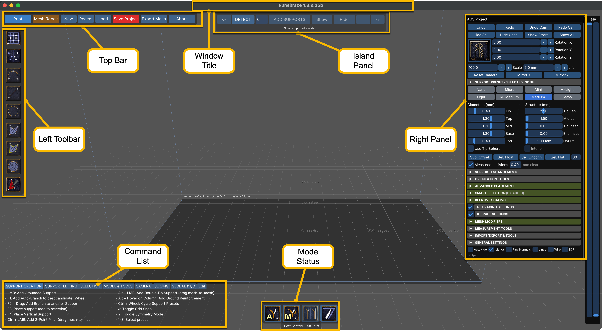
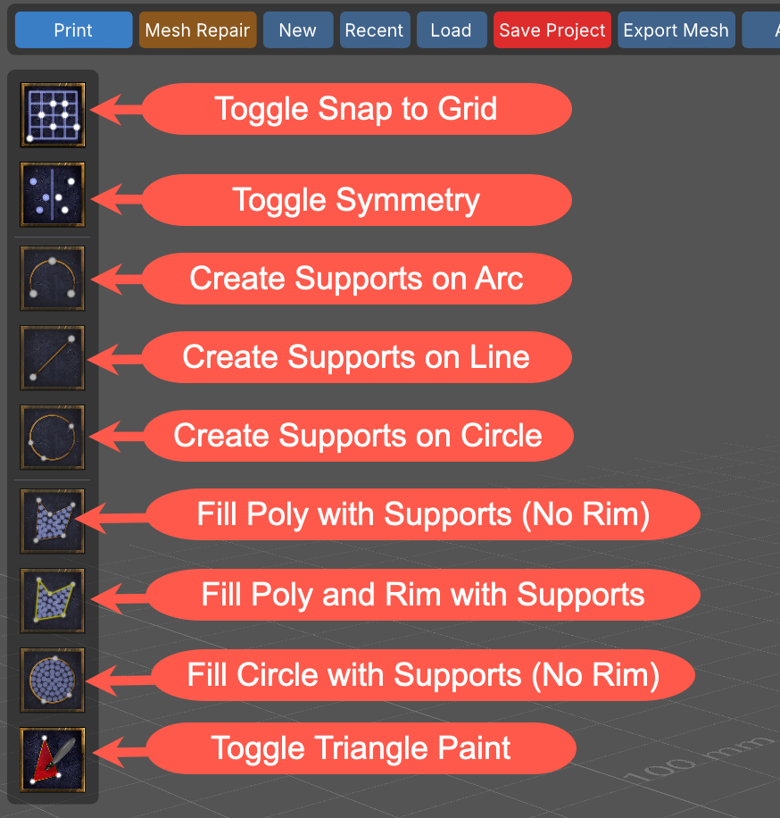
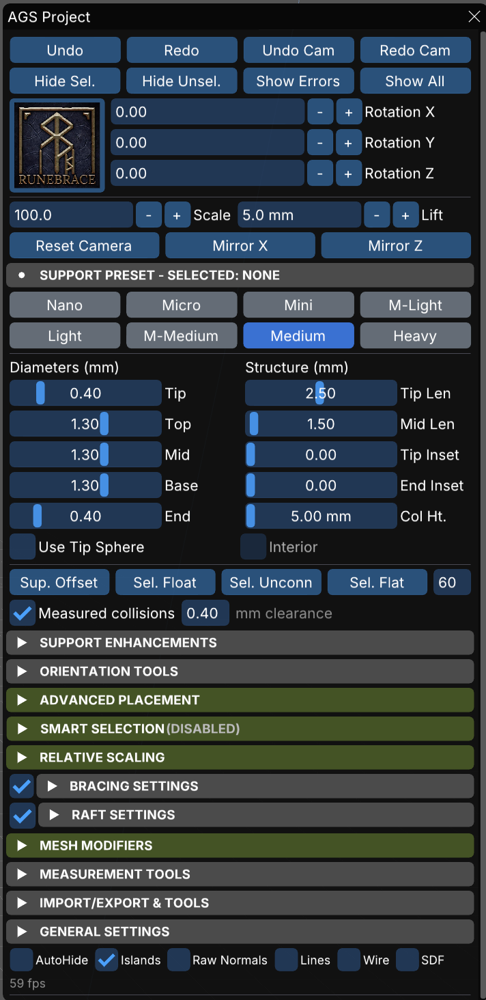
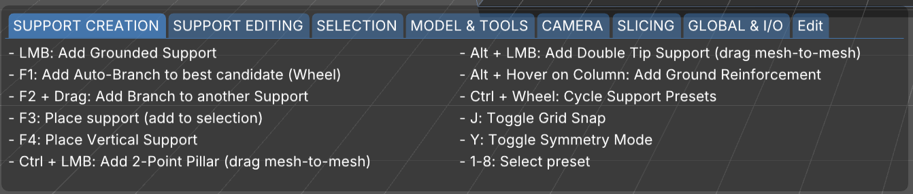
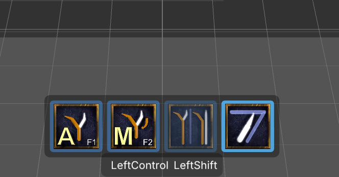
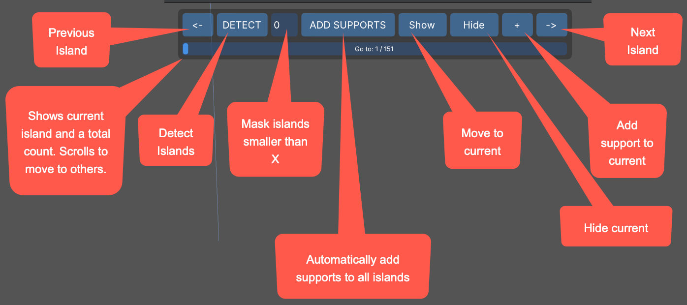

# Getting Started {#GettingStarted}

## Downloading and Installing

### OS/Platform Differences

* Keyboard shortcuts

## UI Overview

Runebrace's User Interface (UI) is shown below with the major functional areas called out.

{#fig:UIOverview}

It's important to get used to the idea that Runebrace has no tooltips anywhere. This is intentional, as tooltips cover up the controls underneath. Controls clearly state their function on the control itself or nearby in the panel.

### Functional Areas and Commands

Below you can find short descriptions of each feature.

#### Top Bar

[Print]{#PrintButton}
: Opens the Print Room (see [Printing and Slicing](#PrintingAndSlicing)

[Mesh Repair]{#MeshRepair}
: Opens the repair window (see [Mesh Repair](#MeshRepair))

[New]{#NewScene}
: Creates a new empty scene

[Revert]{#RevertScene}
: Reloads the file from the last saved version, discarding changes

[Load]{#LoadScene}
: Opens a project or a model, with a Recent list

[Save Project]{#SaveProject}
: Saves in place; a menu also offers Save Project As

[Export Mesh]{#ExportMesh}
: Opens the mesh export menu (see [Exporting Meshes](#ExportingMeshes))

[About]{#AboutRunebrace}
: Displays the Runebrace version, the graphics card in use, important links, and a donation button

There are two styles of file bar. Global Settings has a switch, "Use Standard File Buttons", that chooses between them.

#### Left Toolbar

This toolbar displays icons/buttons for different support tools.

{#fig:LeftToolbar}

#### Right Panel

The Right Panel holds features and controls for nearly all of Runebrace's editing functionality.

{#fig:RightPanel}

Most sections in the right panel are collapsible. Each area will be discussed later in this guide.

#### Command List

The Command List shows what mouse and keyboard actions are currently available. These change with the active tool.

{#fig:CommandList}

The Edit tab allows you to remap some commands to better suit your style and workflow.

You can also find a list of keyboard and mouse shortcuts on the right panel under General Settings.

#### Mode Status

At the bottom are four icons that display current support modes.

{#fig:ModeStatus}

* Branch to nearest candidate. Wheel to scroll through candidates.
* Manually add branch via dragging
* **NEED CONTENT**  
* **NEED CONTENT**

#### Island Panel

The Island Panel allows you to detect, support, hide, and otherwise interact with islands.

{#fig:IslandPanel}

Controls on this panel are:

[<-]
: Move to previous island

[Detect]
: Detect islands on the model

[Island Filter]
: Filters islands below this size in pixels from being displayed, counted, or resolved by the "Add Supports" command. **Islands are not eliminated, just hidden.**

[Add Supports]
: Automatically add supports to islands. Some may be skipped due to mesh complexities.

[Show]
: Rotate model to show the current island

[Hide]
: Hide the current island from the display and count

[+]
: Add a support to the current island

[->]
: Move to next island

The scroll area below the buttons displays a current count of the number of islands, as well as an index of which island you're currently working on. Next and Previous increment/decrement that count as expected. You can also drag the scroll marker to move quickly through supports.

WINDOW TITLE
  Runebrace reports the outcome of an action in the window title, not in a popup.
  "Holes applied", "31 supports shown", "Model swapped", errors, and timings all
  appear there. A reader of the manual should be told to look at it, because
  several actions give no other feedback.

### A Note on Display Scaling

Runebrace's entire UI scales with the window width, starting from a 3840 pixel reference. I.e., a 3840-wide window renders at a scale of 1.0, while a window 1280 wide renders at one third.

Fonts and every aspect of the display scales as well, with nothing being tied to the display DPI.

If you work in a small window, raise the UI Scale and Font Scale settings under Right Panel => General Settings => Global Settings. Both of these multiply on top of the automatic factor.

## Your First Project

## Understanding File Types

