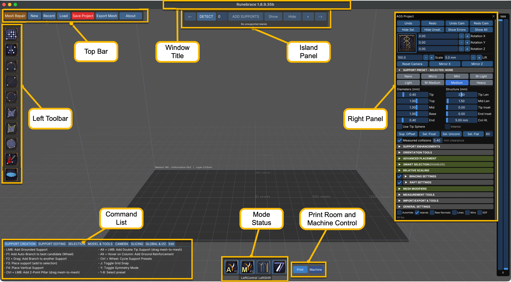
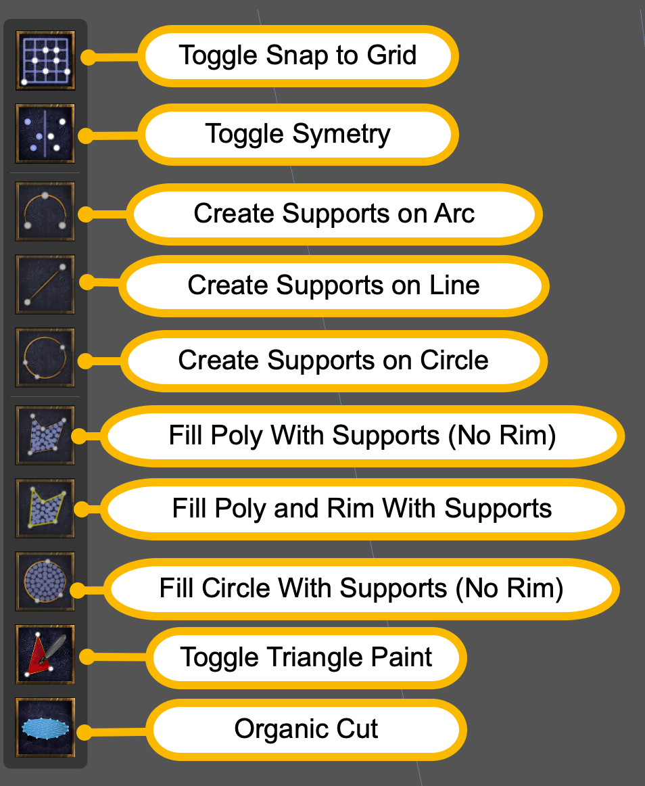
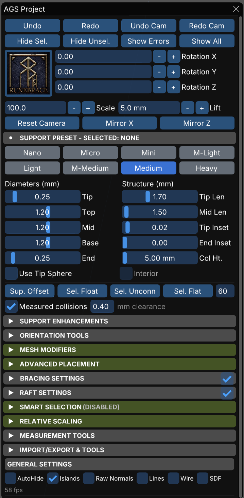
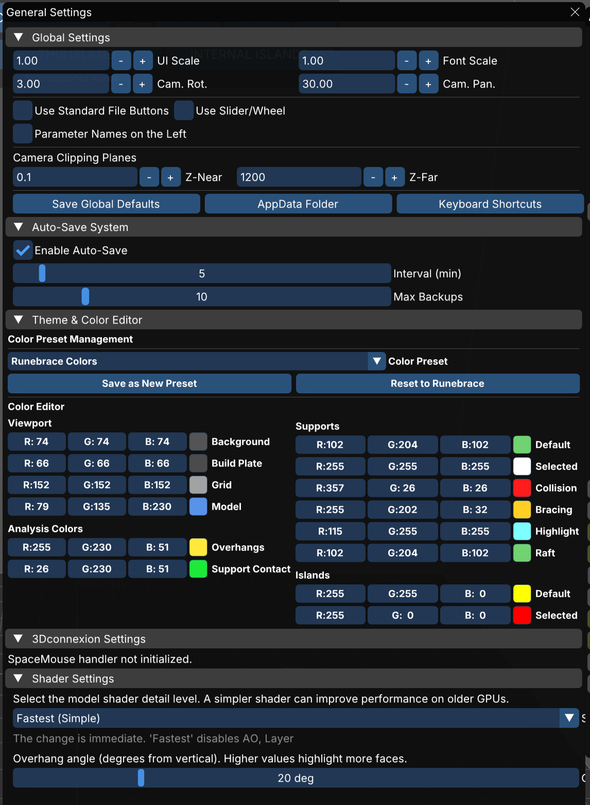
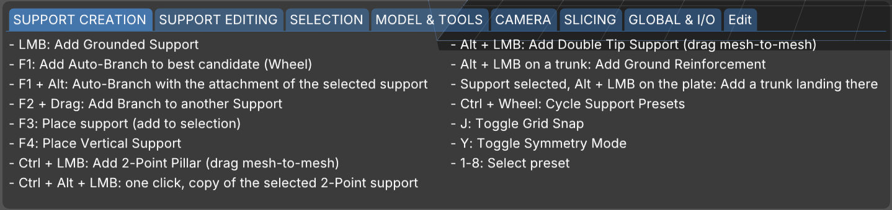
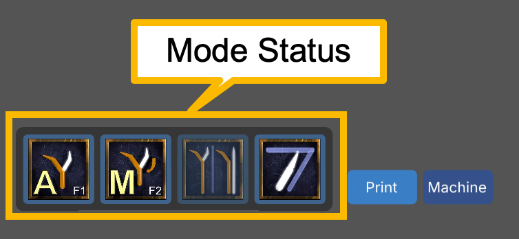
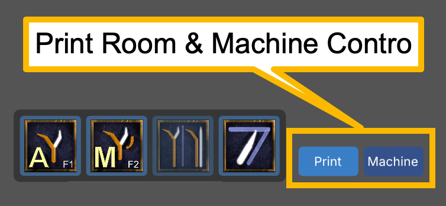
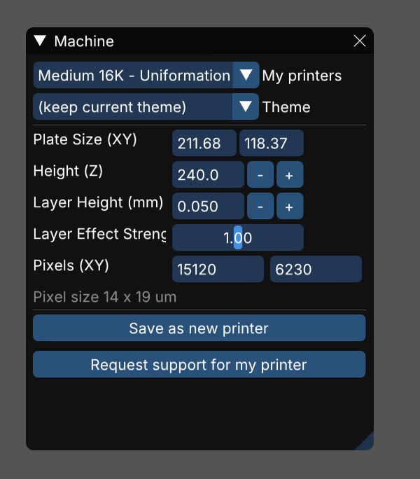
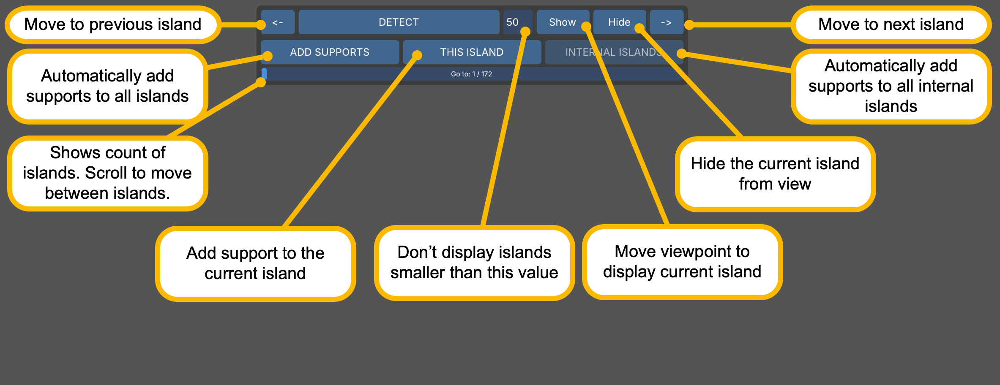

# Getting Started {#GettingStarted}

To get started with Runebrace, you'll first need to download and install it. After that, familiarize yourself with the basic workflow and the high-level UI 

## Downloading and Installing

### OS/Platform Differences

* Keyboard shortcuts

## Basic Workflow

Runebrace gives you the flexibility to do your work however you prefer. Users have different preferences, and sometimes workflows vary because there are different goals for different situations.

One workflow that's common among users in the Runebrace Discord server is:

* Load the model
	* Mesh Check scan runs, resolve issues as desired
* Run Mesh Repair analysis, resolve issues as desired
* Use Organic Cut to separate the model if needed
* Orient the model (manually or auto-orient)
* Detect Islands to show areas in need of support
	* Some users do this later in the flow to point out areas they may have missed
* Alter the model's mesh as needed
	* Scale the model as desired
	* Use the Smoothing tool to smooth out and remove smaller islands, and/or to smooth surfaces as needed
	* Add hollowing and holes as needed
	* Detect and resolve suction cups
	* Detect and resolve resin voids
* Add Supports
	* Internal first if hollowed, then external
	* Repeat island detection, add more supports where needed
* Evaluate overall satisfaction with the model
	* Is mesh quality OK?
	* Are islands and overhangs supported?
	* Are potential peel forces acceptable?
* Optimize supports
	* Grid optimization **OR**
	* Cluster optimization 
* Print
	* Check peel stats, return to editor if needed
		* **IMPORTANT!** Using RMB-> Edit changes the mesh on the print plate. It does **not** change the original model from the AGS project.
		* Changes made to the original AGS in the Editor will require you to delete the model on the plate, then re-add it to the plate

## UI Overview

Runebrace's User Interface (UI) is shown below with the major functional areas called out.

{#fig:UIOverview  .doc-img}

It's important to get used to the idea that Runebrace has no tooltips anywhere. This is intentional, as tooltips cover up the controls underneath. Controls clearly state their function on the control itself or nearby in the panel.

### Functional Areas and Commands

Below you can find short descriptions of each feature.

#### Top Bar

[Mesh Repair]{#MeshRepair}
: Opens the repair window (see [Mesh Repair](#MeshRepair))

[New]{#NewScene}
: Creates a new empty scene

[Recent]{#RecentScene}
: Opens a list of recent projects

[Load]{#LoadScene}
: Opens a project or a model, with a Recent list

[Save Project]{#SaveProject}
: Saves in place; Setting "Use Standard File Buttons" under General Settings will also show "Save Project As"

[Export Mesh]{#ExportMesh}
: Opens the mesh export menu (see [Exporting Meshes](#ExportingMeshes))

[About]{#AboutRunebrace}
: Displays the Runebrace version, the graphics card in use, important links, and a donation button

There are two styles of file bar. Global Settings has an option, "Use Standard File Buttons", that switches between them.

#### Left Toolbar

This toolbar displays icons/buttons for different support tools.

{#fig:LeftToolbar .doc-img}

#### Right Panel

The Right Panel holds features and controls for nearly all of Runebrace's editing functionality.

{#fig:RightPanel .doc-img}

Most sections in the right panel are collapsible. The General Settings section opens into a separate panel. Each of these areas will be discussed later in this guide.

#### General Settings

Clicking the General Settings in the Right Panel will open a new dialog showing the General Settings.

{#fig:GeneralSettings .doc-img}

#### Command List

The Command List shows what mouse and keyboard actions are currently available. These change with the active tool.

{#fig:CommandList .doc-img}

The Edit tab allows you to remap some commands to better suit your style and workflow.

You can also find a list of keyboard and mouse shortcuts on the right panel under General Settings.

#### Mode Status

At the bottom are four icons that display current support modes.

{#fig:ModeStatus .doc-img style="width: 250px;" }

* Branch to the nearest candidate. Wheel to scroll through candidates.
* Manually add a branch via dragging
* Pull a support tip off onto its own column
* Allow a tip to be placed in non-perpendicular situations. See [Tip Inclination](SupportingModels.md#TipInclination)

#### Print Room and Machine Control

To the right of the Mode Status icons are the Print Room and Machine Control buttons.

{#fig:PrintRoomMachine .doc-img style="width: 250px;"}

[Print]{#PrintButton}
: Opens the Print Room (see [Printing and Slicing](PrintingAndSlicing.md#PrintingAndSlicing)

[Machine]{#MachineButton}
: Opens a dialog to select, edit parameters for, and save presets for printers. Also allows editing of a visual theme for printers.

{#fig:MachineDialog .doc-img style="width: 250px;"}

The Machine dialog also offers a button to open a form to request support for unlisted printers.

#### Island Panel

The Island Panel allows you to detect, support, hide, and otherwise interact with islands.

{#fig:IslandPanel .doc-img}

Controls on this panel are:

[<-]
: Move to the previous island

[Detect]
: Detect islands on the model

[Island Filter]
: Filters islands below this size in pixels from being displayed, counted, or resolved by the "Add Supports" command. **Islands are not eliminated, just hidden.**

[Add Supports]
: Automatically add supports to islands. Some may be skipped due to mesh complexities.

[Show]
: Rotate model to show the current island

[Hide]
: Hide the current island from the display and count

[+]
: Add a support to the current island

[->]
: Move to the next island

The scroll area below the buttons displays a current count of the number of islands, as well as an index of which island you're currently working on. Next and Previous increment/decrement that count as expected. You can also drag the scroll marker to move quickly through supports.

WINDOW TITLE
  Runebrace reports the outcome of an action in the window title, not in a popup.
  "Holes applied", "31 supports shown", "Model swapped", errors, and timings all
  appear there. A reader of the manual should be told to look at it, because
  several actions give no other feedback.

### A Note on Display Scaling

Runebrace's entire UI scales with the window width, starting from a 3840 pixel reference. I.e., a 3840-wide window renders at a scale of 1.0, while a window 1280 wide renders at one third.

Fonts and every aspect of the display scales as well, with nothing tied to the display DPI.

If you work in a small window, raise the UI Scale and Font Scale settings under Right Panel => General Settings => Global Settings. Both of these multiply on top of the automatic factor.

## Understanding File Types

Runebrace generates and works with multiple file types. Below is a list of different types.

### AGS
.ags files are Runebrace's project file. It carries the mesh/model file inside of it, which means you can move the .ags file to another computer and the mesh will be included. The .ags also stores all information about supports, hollowing, holes, voxel masks, organic cuts, printer presets, and print parameters.

### Models (STL, OBJ, 3MF)

Runebrace supports importing stl, obj, and 3MF mesh models. Upon import, Runebrace will run a [Mesh Check](WorkingWithMeshes.md#MeshCheck) and report on the state of the model. You're provided with options to resolve potential issues.

Runebrace can export several different formats:

* STL, OBJ, 3MF
	* Exports the scene as is. Includes the model, all mesh changes, supports, bracings, hollowing, holes, internal lattices, and the raft
* Split STL
	* Writes four separate files: The mesh, the supports and bracings, the raft, and internal lattices *if* the model has them
* Modified STL, OBJ, 3MF (Right Panel => Import/Export & Tools)
	* Exports only the model with mesh changes: Smoothing, mesh repairs/fixes, hollowing, holes, and internal lattice. Supports and rafts are **NOT** exported.

### Print Files

Runebrace stores print projects in .agsplate files. These print project files hold all models and settings, which means you can copy the file to another computer and all models and settings will travel along.

Runebrace slices to several different outputs based on the selected printer type:  .sl1s, .ctb, .goo, .prz, .pp1m, .pwsz, and .jxs.

## Your First Project

