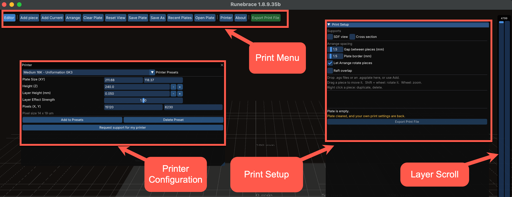
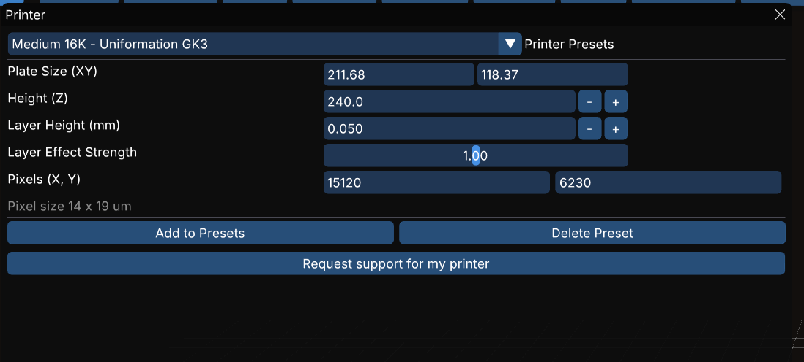

# Printing and Slicing {#PrintingAndSlicing}

The Print Room offers features to prepare and export models to a binary file for a printer.

Print project files (.agsplate) hold everything needed to print a file: printer presets and parameters, plus the complete model. This means you can hand off the .agsplate to someone else to work on with no issues around linked models, parameters, etc.

The Print Room has no undo functionality for actions. This is a deliberate choice, not an omission.

Slicing preview by layer works across all models on the plate.

{#fig:PrintRoomMain}

## Print Menu

[Editor]{#PrintEditor}
: Return to the Edit Room

[Add Piece]{#PrintAddPiece}
: Opens a file dialog to browse to and add a model to the plate

[Add Current]{#PrintAddCurrent}
: Puts the piece currently in the editor onto the plate

[Arrange]{#PlateArrange}
: Lays the pieces out automatically. Affected by the [Let Arrange rotate pieces](@PrintSetupLetArrangeRotate) setting on the Print Setup Menu.
  
[Clear Plate]{#PrintClearPlate}
: Empties the current plate. Does not create a new plate project.

[Reset View]{#PrintSetupResetView}
: Re-frames the print plate view to front, centered, and above

[Save Plate]{#PrintSavePlate}
: Saves the current plate using the current name

[Save As]{#PrintSaveAs}
: Opens the Save As dialog to save the current plate with a new name

[Recent Plates]{#PrintRecentPlates}
: Lists the last plates opened

[Open Plate]{#PrintOpenPlate}
: Opens a plate file

[Printer]{#PrintPrinter}
: Opens the [Printer configuration dialog](@Printer)

[About]{#PrintAbout}
: Opens the [About window](@GettingStarted#AboutRunebrace)

## Printer {#Printer}

The Printer window allows you to work with printer configuration. A list of presets of pre-configured printers are available, or you can build and save your own custom preset.

Changing any of the editable parameters will require saving to a new Printer Preset if you want to maintain the changes.

{#fig:PrinterWindow}

[Printer Presets]{#PrintPrinterPresets}
: Shows a dropdown list of available printers. Click to select.

[Plate Size (XY)]{#PrintPrinterSize}
: The size of the print plate width (X) and depth(Y) in mm. Editable.

[Height]{#PrintPrinterHeight}
: The vertical height of the print plate's volume in mm. Editable.

[Layer Height (mm)]{#PrintPrinterLayerHeight}
: Height of each layer in mm. Editable.

[Layer Effect Strength]{#PrintPrinterLayerEffectStrength}
: The strength of each layer **REWORD**. Editable.

[Pixels (X, Y)]{#PrintPrinterPixels}
: The pixel resolution of the print plate in width (X) and depth (Y). Editable. These figures together with plate size generate the numbers for the Pixel size field below this parameter.

[Add to Presets]{PrintPrinterAddToPresets}
: Opens a new dialog allowing you to save the current settings as a new preset.

[Delete Presets]{PrintPrinterDeletePreset}
: Deletes the currently active preset. Spawns a confirmation dialog.

[Request support for my printer]{PrintPrinterRequestSupport}
: Opens a new dialog enabling you to request support for your printer. Based on the active preset, which means you will have needed to create a new preset if your printer isn't already supported.

## Print Setup Menu

[Let Arrange rotate pieces]{#PrintSetupLetArrangeRotate}
: Allows Arrange to turn pieces to fit more in
  
[Raft overlap]{#PrintSetupRaftOverlap}
: Allows rafts to overlap

  
[Export Print File]{#PrintSetupExport}
: Slices everything on the plate into one file

  Edit the piece sends one piece back to the editor to be changed, and Back to
  print room returns it, so a fix does not mean rebuilding the plate.

  A plate carries its own printer preset and its own print parameters, valid
  inside that room only. Leaving the room gives you back the ones you had.

  The slice preview works here as well, over all the pieces at once.

