# Supporting Models {#SupportingModels}

Supporting your models well is critical for printing success. Proper supports ensure your model doesn't completely separate from the plate during printing, and it also ensures details don't break away or deform.

## Supporting Overview

This manual isn't a tutorial for supporting. There are great resources available in many places.

### What's a Support?

A support is a structure added to your model to prevent peeling or deformation. In its most basic form, a support looks like a vertical shaft with a cone-like "tip" that touches a point on the model, then descends and attaches to a raft under the model.

Very generally speaking, supports are needed in three different scenarios:

* **Islands**
* **Overhangs**
* **Peel surfaces**

## Basic Workflow

**CONTENT NEEDED**

## Features

### Support Basics

A support is a chain of control points with a radius at each one: the tip that touches the model, the top of the shaft, the middle, and the base on the plate. Between them are cones. Every diameter is editable.

Each of those sections has a control point that can be manipulated. Each section's control point has cones between them. Diameters and lengths for each section can be edited. A number of these settings can be saved to [support presets](#SupportPresets).

#### Support Variants

[Grounded]{#GroundedSupport}
: The support's tip is on the model, and the base is on the plate

[Branching]{#BranchingSupport}
: The support joins another support instead of reaching the plate

[Column]{#ColumnSupport}
: A thick pillar with its own end diameter and height

[Double Tip]{#DoubleTipSupport}
: Connects two points of the model, mesh-to-mesh, with no base

[Reinforcement]{#ReinforcementSupport}
: A ground reinforcement added to an existing brace

[Bracing]{#BracingSupport}
: Lateral support between the mid-sections of supports

#### Support Presets {#SupportPresets}

**CONTENT NEEDED**

#### Manual Supports

**CONTENT NEEDED**

#### Left Toolbar (REWORD)

The left toolbar controls many support options.

{#fig:LPanel .doc-img}

### Symmetry

**CONTENT NEEDED**

### Path Supports

[Path](#path) supports are created on a line between two or more supports. A path is drawn from the tip of each support in the order they were selected. (Use F3 + LMB when selecting multiple supports.)

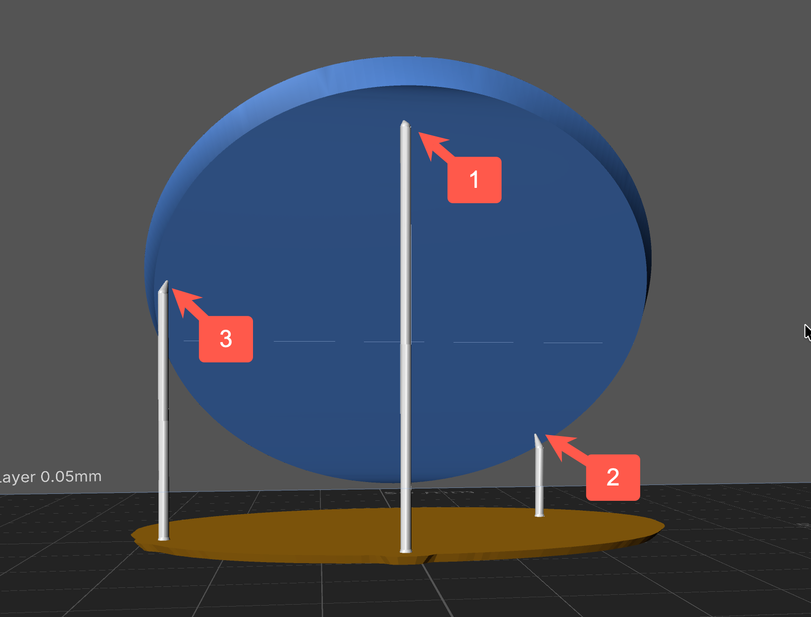{#fig:InitialBaseExample .doc-img}

Settings controlling spacing of supports for the following features are located in the right panel under Advanced Placement => Line and Fill.

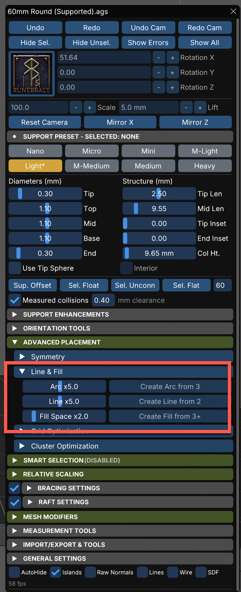{#fig:RPanelAdvPlacement height="400" .doc-img}

> **Important Considerations**

> Settings in this section are not distances in millimeters; they are multipliers of the support diameter. Runebrace determines how many supports fit in the space between the selected supports, then spreads generated supports evenly along the segment.

> Very small values stop having an effect at some point, and are ignored.

> A segment too short to fit anything gets no supports.

#### Line

Adds support along a line between two and only two supports. 

Line placement is available through the right panel and the left toolbar ([@fig:LPanel]).

Spacing for supports along the line is controlled by the right panel under Advanced Placement => Line & Fill => Line.

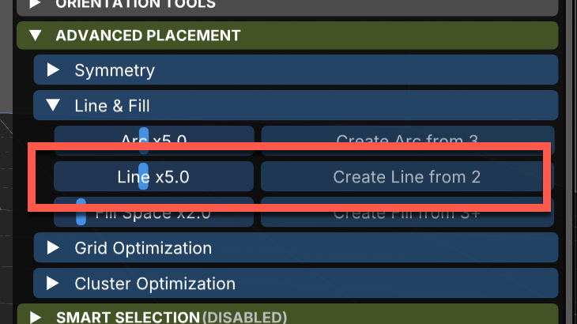{#fig:RPanelAdvPlacementLine .doc-img}

Selecting support #1, then #2, then creating Line supports results in this:

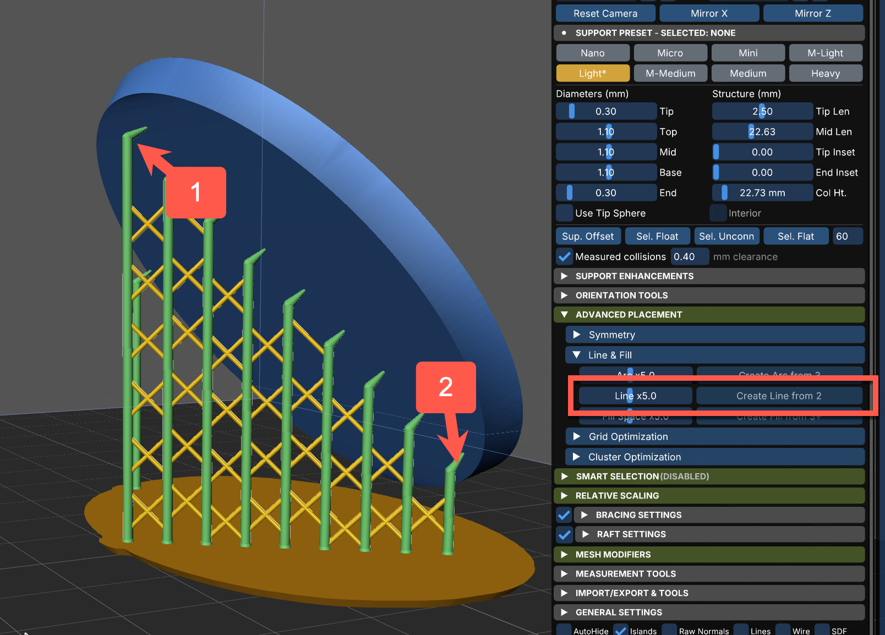{#fig:RoundExampleCreateLine .doc-img}

For more details on how lines work, see the [deep dive on lines](#MoreAboutLines)

#### Arc

Using Arc adds supports along three selected supports&mdash;no more, no fewer.

Arc placement is available through the right panel and the left toolbar ([@fig:LPanel]).

Configure using the settings in the right panel Advanced Placement => Line & Fill => Arc.

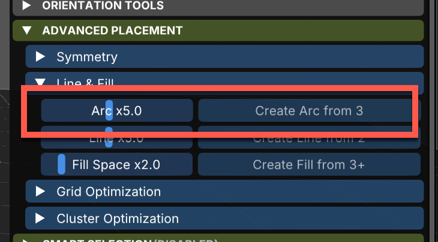{#fig:ArcSettings .doc-img}

Selecting support #1, then #2, then #3, then creating Arc supports results in this:

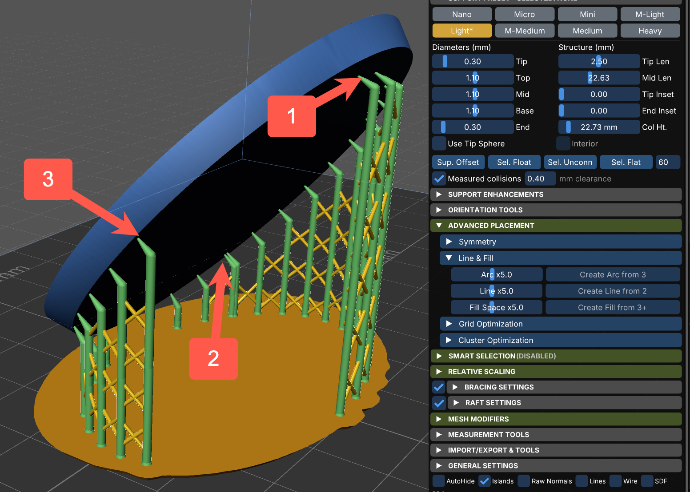{#fig:RoundExampleCreateArc .doc-img}

Note the double supports appearing at callout #2. This is due to the spacing along the arc, with one added support being in close proximity to the original #2.

#### Circle

Using Circle adds supports along a circle path drawn through three supports&mdash;no more, no fewer.

Circle placement is available **only** through the left toolbar ([@fig:LPanel]).
 
Configure using the settings in the right panel Advanced Placement => Line & Fill => Arc as shown above in [@fig:ArcSettings].

Selecting support #1, then #2, then #3, then creating Circle supports results in this:

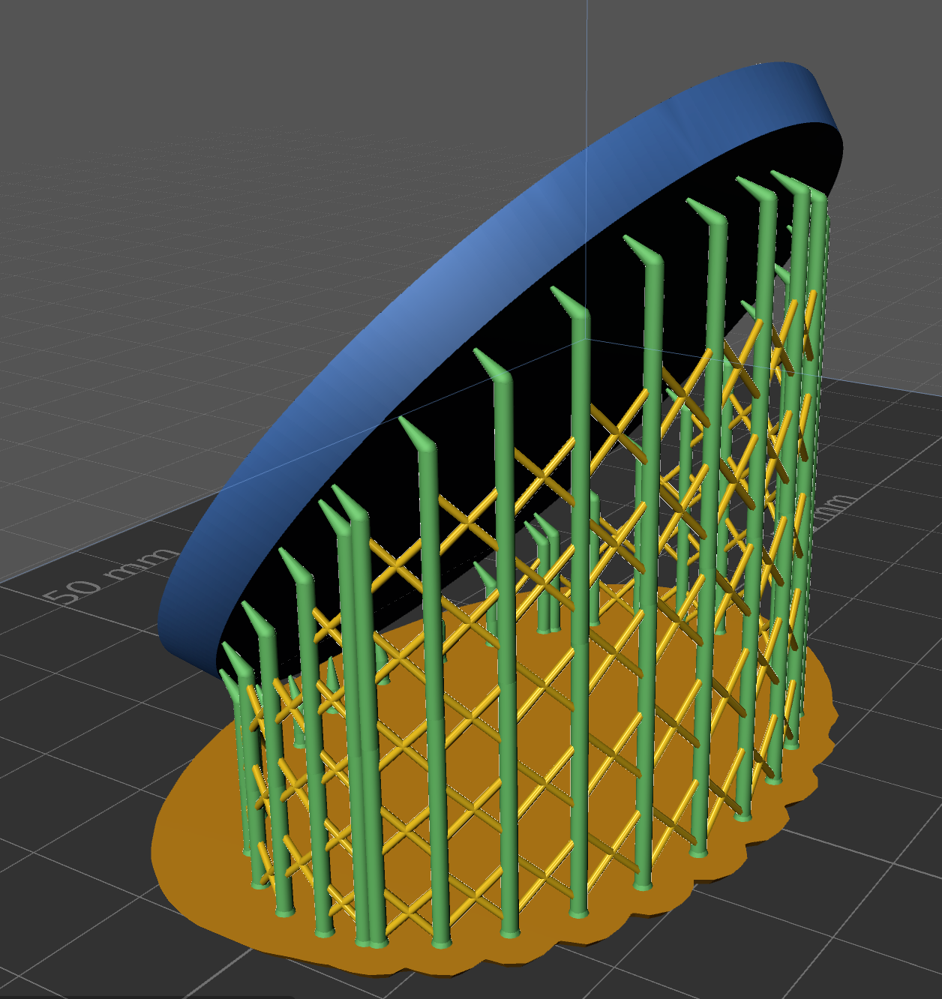{#fig:RoundExampleCreateCircle .doc-img}

Again, note the doubled supports, this time at #2 and #3.

### Fill Basics

Runebrace also provides area fill capabilities.

We'll start with a basic example, then show a more complex, practical example after. Triangle Painting and fills are covered separately below.

Each feature below will show results starting from the above figure [@fig:InitialBaseExample], a round base with three supports selected in the order they're labeled.

#### Polygon Fill

Polygon Fill, commonly referred to as Poly Fill, fills an area defined by three or more supports. No rim support is created.

Poly Fill is available through the Fill Space option in the right panel and the corresponding button on the left toolbar ([@fig:LPanel]).

You can also use the Fill Space button from the right panel (see below).

Using Poly Fill/Fill Space from our starting point results in this:

{#fig:RoundExamplePolyFill .doc-img}

**Why:** EDIT: ADD USE CASE

Adjust the spacing of the filled supports under right panel => Advanced Placement => Line and Fill => Fill Space

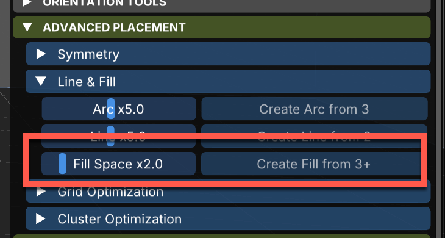{#fig:RPanelFillSpace height="200" .doc-img}

#### Perimeter and Fill

Perimeter & Fill does the same as Poly Fill but also lays supports along the area's bordering path itself. Note the menu button's icon shows this via the yellow outline.

Poly Fill is available **only** through the corresponding button on the left toolbar ([@fig:LPanel]).

Select three or more supports, then press the Perimeter and Fill button (there's no alternative from the right panel). One action creates the perimeter and inside area supports.

Using Perimeter and Fill from our starting point results in this:

{#fig:RoundExamplePolyFillPerim .doc-img}

Perimeter and Fill has two separate adjustments:

* **Line:** Spacing between supports on the lines of the outer perimeter
* **Fill Space:** Spacing between supports in the grid that fills the area

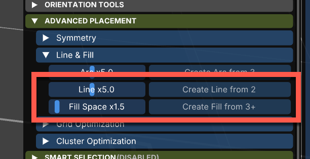{#fig:RPanelAdvPlaceLineAndFill height="200" .doc-img}

These settings are demonstrated in the example below. The perimeter supports are denoted by the red hash lines and were configured with a spacing of 5.0. The inside area was configured with a spacing of 1.5.

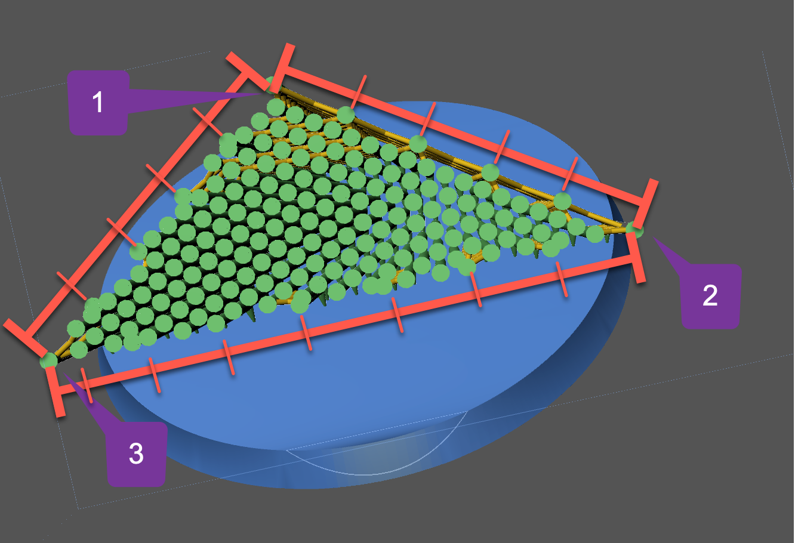{#fig:PolyFillBelow .doc-img}

#### Circle Fill
Circle Fill takes exactly three supports, builds a circular path that passes through their contact points, and fills that. No path supports are created.

Circle Fill is available **only** through the corresponding button on the left toolbar ([@fig:LPanel]).

Using Circle Fill from our starting point results in this:

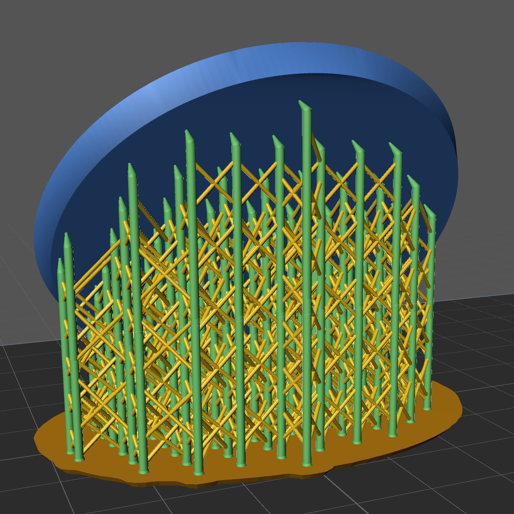{#fig:RoundExampleCircleFill .doc-img}

From below, the result looks like:

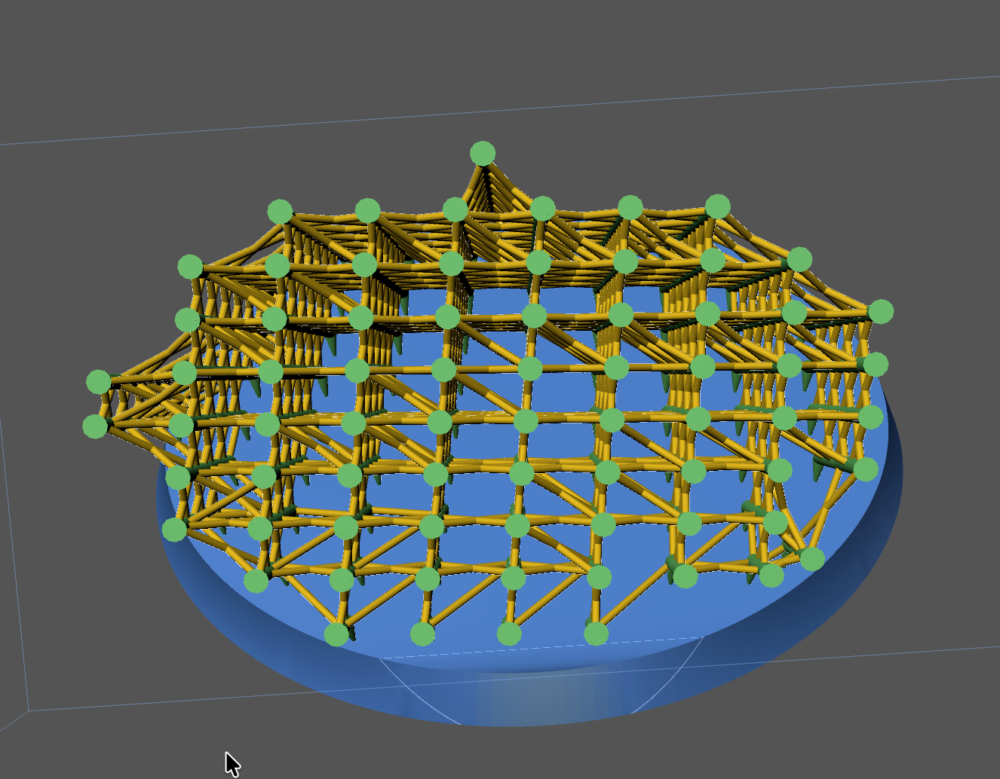{#fig:RoundExampleCircleFillBelow .doc-img}

## Triangle Painting

[Rim](guides/Glossary.md#rim)

## Deeper Dive on Placement

The sections below provide a more advanced discussion of how specific placement features work.

### More About Lines {#MoreAboutLines}

Drawing support lines or arcs actually simulates clicking on various points of the line. Those points depend on the distance set in the menu options. Runebrace then performs a [raycast](#raycast) on the model.

If the raycast hits the geometry, then a check is made on the impacted face at that point. If the face is not parallel to the build plate, or tilted upward, then a support is placed at that point. **CONTENT NEEDED: why not parallel or upward?**

Areas where the raycast misses the model mean a support can't be placed there; there's no intersecting geometry. Supports are skipped for those areas.

Put differently: It's not a matter of whether the surface is flat. The geometry must be under the ray and must be a valid point for a support.

<!--**lines**
"What happens when you draw support lines or arcs is that it simulates a mouse clicking on various points along this line (depending on the set distance) and performs a mouse [raycast](#raycast) on the model. If the raycast hits the geometry and the face is not parallel to the build plate or tilted upwards, a support is placed. It is likely that there are some raycast misses, so the support cannot be placed and is skipped.  It's not a matter of whether the surface is flat... the geometry must be under the ray cast by the mouse and be a valid point for a support."-->

### More About Perimeters {#MoreAboutPerimeters}

#### Selection Order Impact on Perimeters and Areas

Perimeters are always created in selection order. The loop is closed from the last support back to the first. This matters greatly as to how supports will be created.

In this first example, supports were selected in order going counter-clockwise.

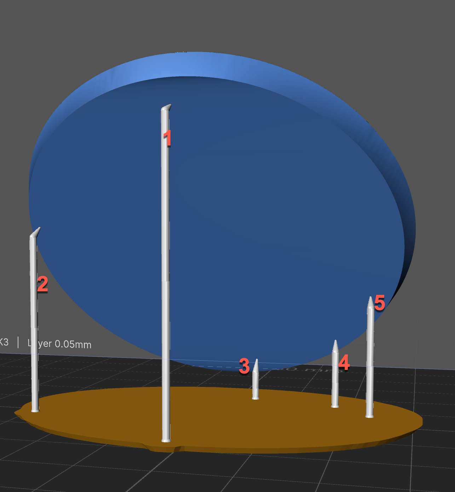{#fig:5SupportV1 .doc-img}

Using Perimeter and Fill, the result is

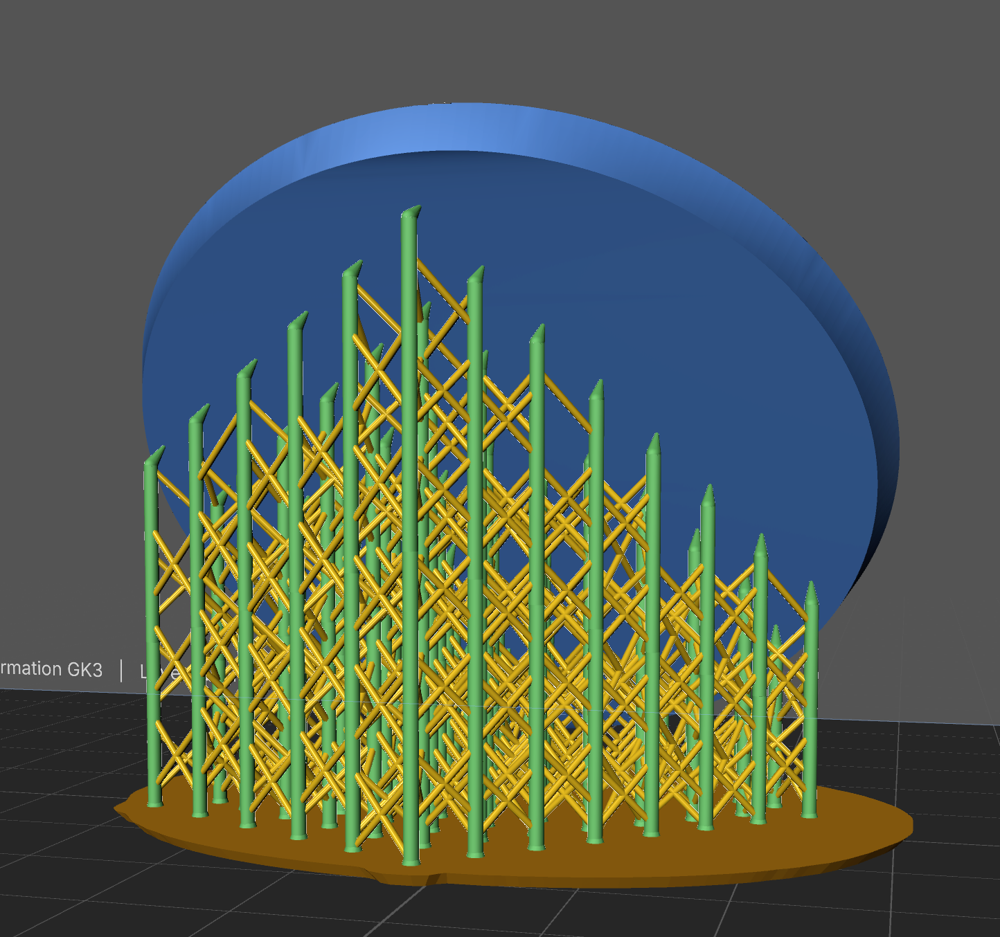{#fig:5SupportV1Result .doc-img}

Now look at an example with a non-sequential selection:

{#fig:5SupportV2 .doc-img}

Using Perimeter and Fill, the result is

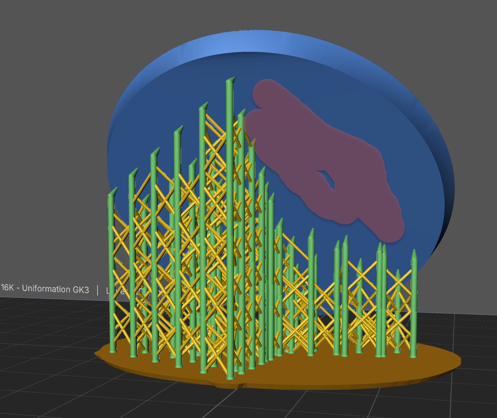{#fig:5SupportV2Results .doc-img}

It's easy to see the area between supports 1 and 3, marked with the light red scribble, got no supports. This is because the rim path didn't connect those supports, so there wasn't an area to fill.

#### Understanding Support Impacts on Fill Planes
Area fills are performed on a planar basis. The plane is defined by the first three selected supports, not all selected supports. Additional supports are flattened onto the plane defined by the first.

This results in selected areas not filling the way one might expect.

This example shows the base of a model with a surface that significantly changes orientation. Five supports are selected as noted.

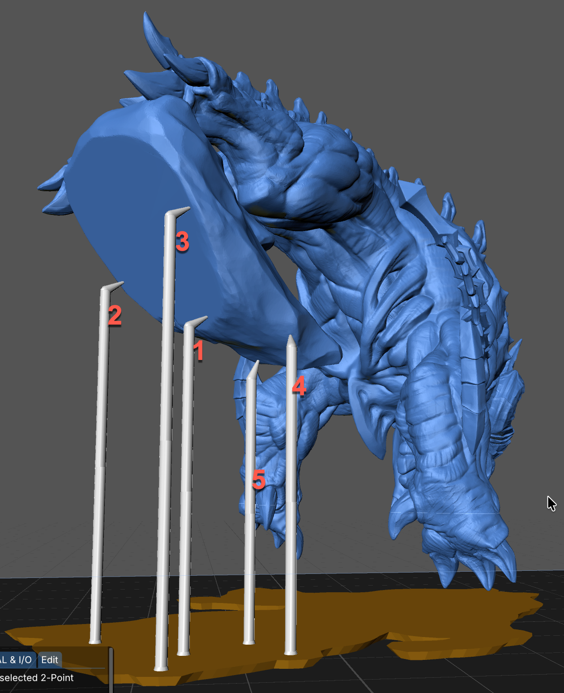{#fig:FillPlaneExample .doc-img}

The Poly Fill results in a gap being left as marked by the red zone. This is despite that area being valid for additional supports, as shown by the ability to place manual supports there&mdash;the white transparent support by the mouse cursor.

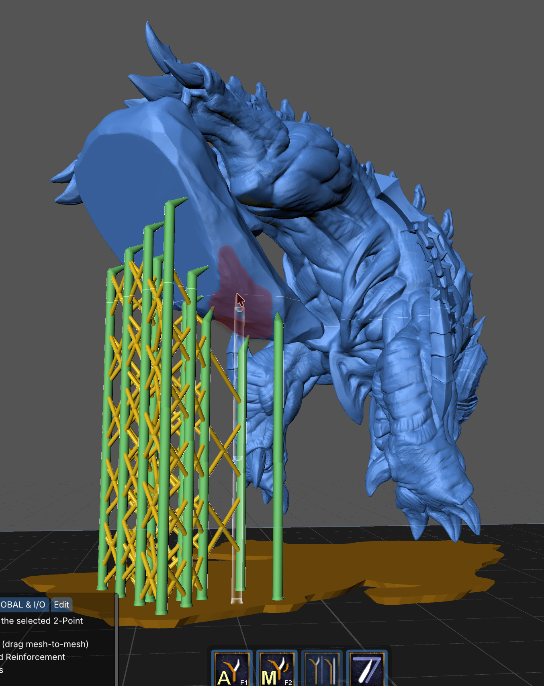{#fig:FillPlaneExampleResult .doc-img}

Runebrace creates a grid covering the bounding box of the polygon *in the plane defined by the first three supports*. That grid has two axes: the first defined by the line from the first support to the second, and the second axis perpendicular to the first. See the example [@fig:PolyFillBelow] from earlier for a good visualization of this.

All the selected supports have their tip directions averaged together. Then, each grid point is projected onto the model using that average direction, creating a raycast from each grid point in the average tip direction. This is used to help the fill follow the surface of the defined area.

Each resulting raycast is used to check for intersections with the mesh for appropriate supportable surfaces, and if so, a support is placed. If the ray misses the mesh, then no support is placed, which is why gaps occur in fills.

#### Understanding Line and Fill Settings

Line and Fill Space settings are multipliers, not distances. Both tie to support diameters for the currently selected support type. Each ties to different parameters: Line ties to support base diameters, while Fill Space ties to a support's Top (not tip!) diameter.

As a result, the same setting on Line and Fill will result in different spacing depending on the targeted support type's configuration.

#### Undoing Fill Operations

Note that Perimeter and Fill actions are recorded as separate undo operations. This means you'll need to do two separate undo actions to back out that operation.

#### Understanding the Math for Determining Support Placement

The following formula is used when determining how supports are placed along a line.

> Step = Base diameter × Line (or Top diameter × Fill Space) 
> 
> Gaps = segment length ÷ step, rounded down 
> 
> Supports added = gaps − 1, spread evenly, so the real spacing is segment length ÷ gaps. 
> 
> Because the count rounds down, the spacing is always at least the step and can reach almost double it.

## Support Presets

Each tip can be configured 