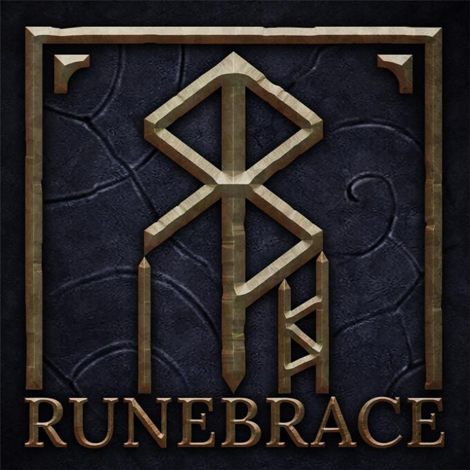

# Runebrace User Manual

{height="200"}

## What is Runebrace?

Runebrace helps you take a 3D model from its initial mesh state to a ready-to-print file for your resin printer.

Runebrace provides unique, powerful features in a smooth workflow to help users quickly accomplish support work. It's engineered by professional modelers and supporters to create perfect prints.

## Index

1. [Overview](guides/Overview.md#Overview)
	
	* What is Runebrace
	* Why Runebrace
	* Getting Help
	 
2. [Getting Started](guides/GettingStarted.md#GettingStarted)
	* Downloading and Installing
	* UI Overview
	* Your First Project
	* Understanding File Types

3. [Supporting Models](guides/SupportingModels.md#SupportingModels)
	* Basic workflow
		* Placing supports
	* Features
		* 
	* Presets

4. [Working with Meshes](guides/WorkingWithMeshes.md#WorkingWithMeshes)
	* Repairs
	* Replacing a Mesh/Model
	* Cutting a Mesh
	
5. [Hollowing](guides/Hollowing.md#Hollowing)
6. [Printing and Slicing](guides/PrintingAndSlicing.md#PrintingAndSlicing)

# Glossary
See the [Glossary](guides/Glossary.md#Glossary) for a list of commonly used terms and definitions.