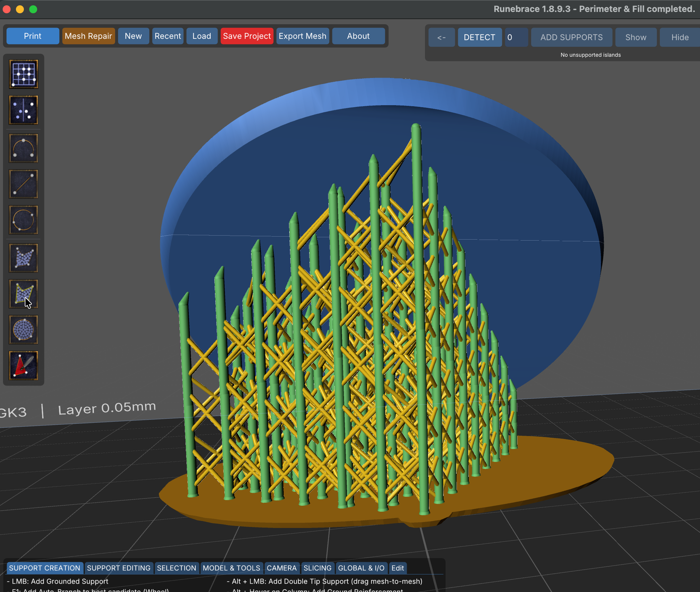

# Supporting Models

## Supporting Overview

<!--Don't write a tutorial. Point users elsewhere.-->

## Basic Workflow

## Features

### Support Basics

* Horizontal line of layers

#### Manual Supports

### Symmetry

### Path Supports

Path supports 

#### Line

"What happens when you draw support lines or arcs is that it simulates a mouse clicking on various points along this line (depending on the set distance) and performs a mouse raycast on the model. If the raycast hits the geometry and the face is not parallel to the build plate or tilted upwards, a support is placed. It is likely that there are some raycast misses, so the support cannot be placed and is skipped.  It's not a matter of whether the surface is flat... the geometry must be under the ray cast by the mouse and be a valid point for a support."

#### Arc

#### Circle

### Fill Basics

We'll start with a basic example, then show a more complex, practical example after. Triangle Fills will be covered in a separate section below.

All examples start from this point.

#### Polyfill

#### Polyfill + Boundary

#### Circle Fill

## Triangle Painting

[Rim](guides/Glossary.md#rim)

## Presets