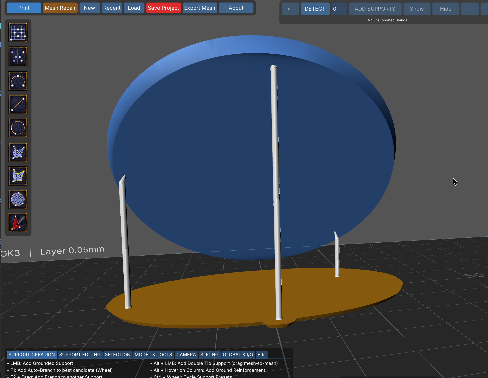
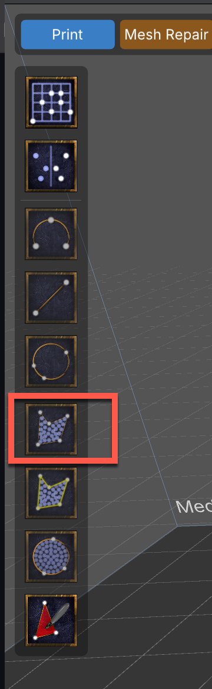
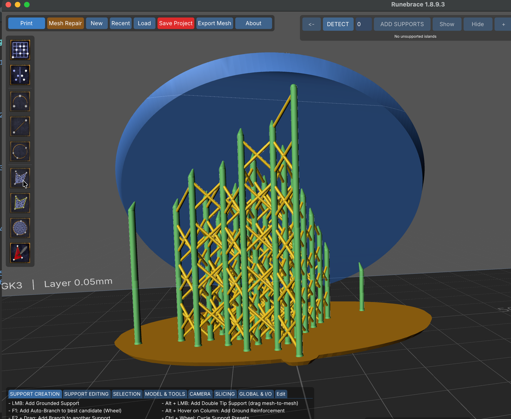
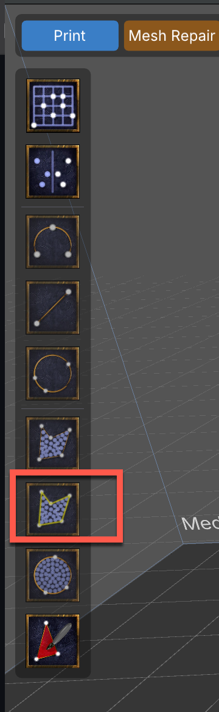
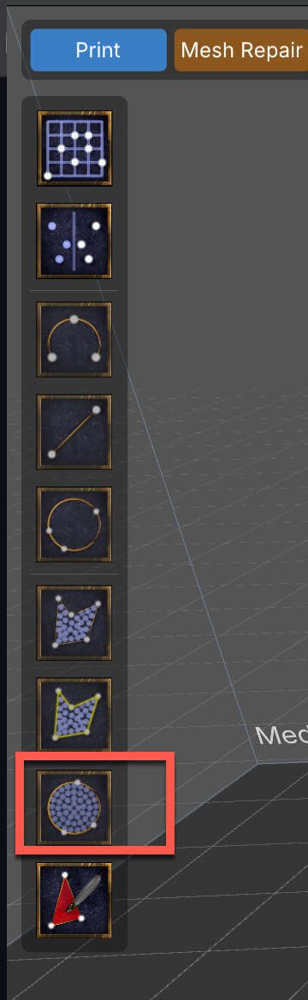
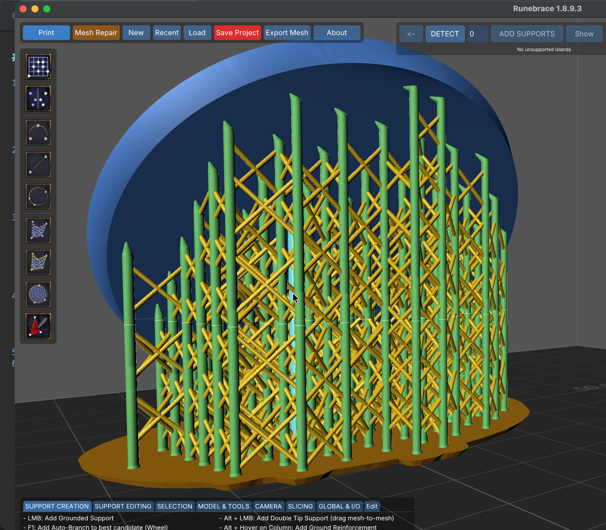

# Supporting Models

## Supporting Overview

<!--Don't write a tutorial. Point users elsewhere.-->

## Basic Workflow

## Features

### Support Basics

* Horizontal line of layers

#### Manual Supports

### Symmetry

### Path Supports

[Path](#path) supports 

#### Line

"What happens when you draw support lines or arcs is that it simulates a mouse clicking on various points along this line (depending on the set distance) and performs a mouse raycast on the model. If the raycast hits the geometry and the face is not parallel to the build plate or tilted upwards, a support is placed. It is likely that there are some raycast misses, so the support cannot be placed and is skipped.  It's not a matter of whether the surface is flat... the geometry must be under the ray cast by the mouse and be a valid point for a support."

#### Arc

#### Circle

### Fill Basics

We'll start with a basic example, then show a more complex, practical example after. Triangle Fills are covered separately below.

All examples in this section start from this figure, a round base with three supports selected in the order they're labeled.

Each feature below will show results starting from the above figure.

#### Polygon Fill

Fill an area defined by three or more supports. 

Select three or more supports using F3 + LMB, then use   the Poly Fill button on the left menu.

{height="200"}

You can also use the Fill Space button from the right menu (see below).

Using Poly Fill/Fill Space from our starting point results in this:

**Why:** EDIT: ADD USE CASE

Adjust the spacing of the fill under Right Menu => Advanced Placement => Line and Fill => Fill Space

{height="200"}

#### Perimeter and Fill

Perimeter & Fill does the same but also lays supports along the outline itself. Note the menu button's icon shows this via the yellow outline.

Select three or more supports, then press the Perimeter and Fill button (there's no alternative from the right menu). One action creates the perimeter and inside area supports.

{height="200"}

Using Perimeter and Fill from our starting point results in this:

Perimeter and Fill has two separate adjustments:

* **Line:** Spacing between supports on the lines of the outer perimeter
* **Fill Space:** Spacing between supports in the grid that fills the area

These settings are demonstrated in the example below. The perimeter supports are denoted by the red hash lines and were configured with a spacing of 5.0. The inside area was configured with a spacing of 1.5.

#### Circle Fill
Circle Fill takes exactly three supports, builds the circle that passes through their contact points, and fills that.

{height="200"}

Using Circle Fill from our starting point results in this:

## Triangle Painting

[Rim](guides/Glossary.md#rim)

## Presets